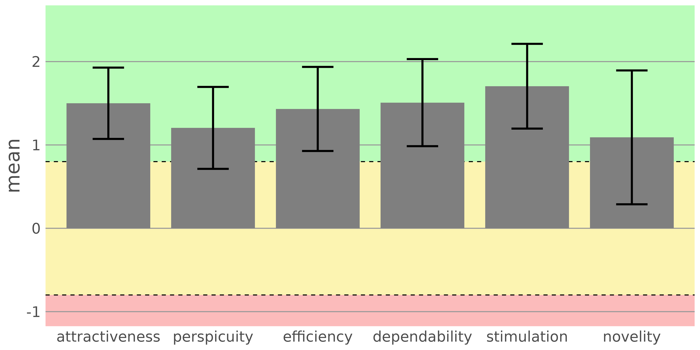

# top-framework-evaluation

## Introduction

This repository contains the result data of the online survey for evaluating the user experience of
the [TOP Framework](https://github.com/Onto-Med/top-deployment), distributed in 2024.
The [User Experience Questionnaire](https://www.ueq-online.org/) (UEQ, version 11) was used to assess
the user experience.
[REDCap](https://project-redcap.org/) was used to create and distribute the online survey.

## Analysis

[analysis.qmd](./analysis.qmd) is a [Quarto](https://github.com/quarto-dev/quarto-cli)-based evaluation
script that was used to generate the report [analysis.pdf](./analysis.pdf).

Analysis were performed using the [R](https://www.r-project.org/) programming language (version 4.3.3).

***Figure 1:** UEQ scale means of the survey results. 95% confidence interval is indicated with black lines.
Values between -0.8 and 0.8 represent a neutral evaluation, while values above 0.8 represent a positive
evaluation and values below -0.8 represent a negative evaluation.*

## Survey Data

The survey result data is located in the `data/` directory as CSV file.

Columns in the CSV file are:

- **record_id:** the unique identifier for each survey response
- **redcap_survey_identifier:** the identifier for the survey instrument in REDCap
- **user_experience_questionnaire_timestamp:** the timestamp when the survey was completed
- **q_example:** an example question from the User Experience Questionnaire
- **additional_input:** any additional input provided by the user as free text
- **q_1 - q_26:** the responses to the User Experience Questionnaire questions
  responses are on a scale from 1 to 7, where 1 and 7 are strong agreements to opposite statements
- **user_experience_questionnaire_complete:** indicates whether the survey was completed (2) or not (0)

## License

The data and analysis script in this repository are licensed under the [MIT License](./LICENSE).
